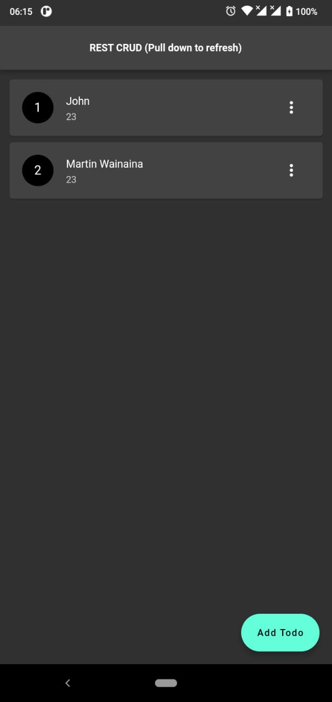
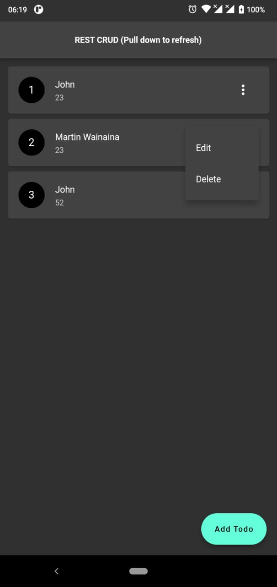

# flutter_crud_rest
- Simple REST CRUD Operation applicattion
- Link to the api: https://github.com/martin-ngigi/flutter_crud_rest

# Screenshots
1. Get all students
- 

2. Add student
- 

3. Update a student
- 

4. Options all students
- 
